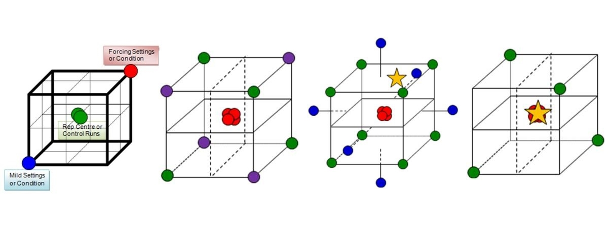

## :material-robot-outline:  **Step 0: Equipment set up**

DROP is an add on to a Hamilton STAR system that consists of hardware, software, and protocols specific to this work. Other Hamilton systems could be used with some modifications to the Method/Layout files and LFA hardware. 

    
<small>Figure 1. Image of Hamilton STAR with specific add ons required for DROP. This includes 8 individual pipetting channels (other options are 96 and 384 head, which work well for plate applications but are not flexible enough for LFA applications), VENUS software, tip and plate carriers, and on board camera. NAAT applications also require a HEPA filter and UV light to reduce the risk of contamination. </small>

**Additional recommended capabilities:**

*LFA applications -*

+ Lateral flow strip preparation and assembly 
+ 3D printing (internal or outsourced) to make LFA strip holders 
+ Laser cutting (internal or outsourced) to make LFA cassette holders 

*NAAT applications -*

+ PCR hood for clean reagent preparation 
+ Gel capabilities 
+ Thermocyclers 

After setting up the Hamilton STAR and ancillary equipment, the software specific to the DROP system must be installed. More detail instructions for installation can be found under "DROP Installation". 

## :simple-materialdesignicons: **Step 1: Experimental Design**

Experimental design for LFAs and NAATs can take many forms. One of the major benefits of an automated liquid handling system is the ability to run large experiments with high reproducibility. Therefore, Design of Experiments (DoE) has been used as an approach to characterize and/or optimize different diagnostic chemistries in the most efficient and informative way possible. Some of our favorite approaches for DoE are:

+ Full factorial design to determine the best antibody pairs for a given antigen target 
+ Taguchi design for PCR optimization 

More detail on each of these can be found in the respective RoboLFA and RoboNAAT Modules. 

  
<small>Figure 2. Graphical representation of experimental designs for a 3-dimensional experimental space. Image from [Prism UK](https://prismtc.co.uk/resources/blogs-and-articles/the-sequential-nature-of-classical-design-of-experiments).  </small>

## :material-test-tube: **Step 2: Experiment Setup**

Experiment setup includes preparation of the required materials to run the experiment as well as the worklist. 

+ For LFA experiments, this can include making antibody conjugates and preparing LFA membranes
+ For NAAT experiments, this can include primer design and identification of the appropriate reagents and controls 

With this information, as well as the inputs from the Experimental Design step, a worklist with the step by step commands for the robot can be made. There are a few different ways to make a worklist, but we will mostly discuss the use of an AWS Web Application termed the Robotic Assay Development Application (RADA) designed for an improved user experience. 

## :material-hazard-lights: **Step 3: Experiment Validation**

Validation of a given experiment or protocol is even more important when working with an automated liquid handling system. Not only are there more things that can go wrong, but the potential impact of an error is much higher when operating with much larger experiments. For the DROP system, experiment validation includes:

+ Testing the worklist in simulation to identify errors on the software/robotics side
+ Testing the experiment with a subset of the final conditions to identify error modes that may impact outcome 

A full experiment should not be run if there are errors that occur in either of these two categories. 

## :material-robot-industrial: **Step 4: Run Experiment**

This step is exactly what it sounds like, run the experiment that has been designed and validated. Something to be mindful of is that there are efforts on the DROP system that can span multiple robot runs. 

## :octicons-graph-16: **Step 5: Data Analysis**

The DROP system includes two data analysis tools, one designed for analyzing LFA images captured using the Hamilton STAR and one for analyzing raw NAAT data from a thermocycler. Both tools utilize Jupyter Notebook and Python. More information about each tool can be found in their respective platform tabs (roboLFA and roboNAAT). 

## :material-repeat: **Step 6: Iterate**

As needed.

