## Preparing for installation
1.	Installation requirements for simulation only: 
    - Windows OS (DROP has not been verified with Mac OS)
    - Admin access
    - .NET framework 3.5 or higher. If not already installed on your machine, download from Microsoft here - [link](https://www.microsoft.com/en-us/download/details.aspx?id=21)
    - Microsoft excel or other software that can open and edit .csv files 
2.	Installation requirements for connection to Hamilton STAR 
    - Refer to Hamilton Robotics or local Hamilton distributor 

## Files required for installation 

- DROP Method and Layout Files 
    - :material-folder-download: [DROP LFA Package File (contains Method and Layout file)](./Installation Files/DROP_NAAT_v2.pkg)
    - :material-folder-download: [DROP LFA Package File (contains Method and Layout file)](./Installation Files/DROP_LFA_v2.pkg)
- :material-folder-download: [DROP Liquid Classes](./Installation Files/DROP_Liquid_Classes.mdb) 
- Test Worklists 
    - :fontawesome-solid-file-csv: [Test Mastermix Worklist](./Installation Files/Test_mastermix_worklist.csv) 
    - :fontawesome-solid-file-csv: [Test sample worklist](./Installation Files/Test_sample_worklist.csv)
    - :fontawesome-solid-file-csv: [Test LFA cartridge worklist](./Installation Files/Test_LFA_cassette_worklist.csv) 
    - :fontawesome-solid-file-csv: [Test LFA strip worklist](./Installation Files/Test_LFA_strip_worklist.csv)
- Support packages
    - :material-folder-download: [Shortcuts Import](./Installation Files/VENUS-Export.zip)
    - :material-folder-download: [EasyPickII Library](./Installation Files/easyPickIIApplication.zip)

## VENUS installation
1.	Download VENUS onto local machine. Also download the following supporting files that are required as described above.
2.	Run Venus.STAR.Installer.exe and follow the prompts. This step might take a while.
    - When you get to the "Select Features" window, make sure to select ALL features listed. If you skip this step, the final software will not be able to run the Method correctly.    
    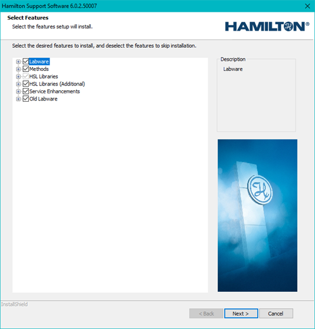  
    <small>Figure 1. Screenshot of VENUS software installation wizard. Select all features to ensure proper execution of the Method. </small>   
3.	Once installation is completed, open the VENUS software. 

## Method and Library Import 
4.	Navigate to System Tools and click on Hamilton Method Editor. 
    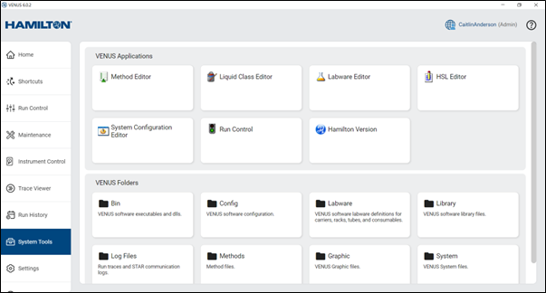  
    <small> Figure 2. User view of System Tools. Important locations to note for installation are the Method Editor and Liquid Class Editor in the top row. </small>   
5.	Load following package files one at a time. Make sure they are saved locally onto the machine. 
    - DROP_NAAT.pkg
    - DROP_LFA.pkg
    - STAR_Animations V1.6.0 200416.pkg 
6.	Select "Import" in the Hamilton Method Editor. Make sure to select Import Method/Library/Workflow. Select the "..." and navigate to the .pkg file you are installing. Select "Next".    
    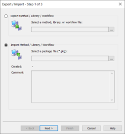  
    <small> Figure 3. Pop up in Hamilton Method Editor to Import a Method file. Make sure that Import Method / Library / Workflow are selected. </small>   
7.	Select "Import into Default Directories". Once selected, click "Next".   
    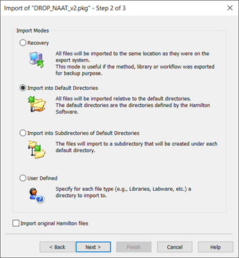  
    <small> Figure 4. Instructions for importing a new Method into the Hamilton Method editor. It is recommended to select "Import into Default Directories" as the best option. </small>   
8.	The package file will be imported. There might be a popup that says that the file already exists and that the existing file is newer than the file in the package. If you get this pop up, select the option "No to all".   
    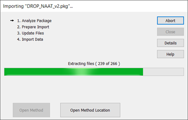  
    <small> Figure 5. Screen while the Method is being imported by the Method Editor. </small>   
    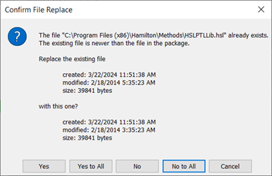  
    <small> Figure 6. Pop up that may occur when importing a Method in the Method Editor. It is recommended to select "no to all" if the existing file is newer than the file in the package. </small>   
    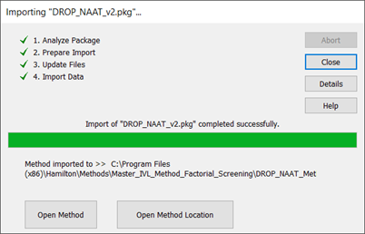  
    <small> Figure 7. Completed import of a Method in the Method Editor. </small>   

9.	Repeat steps 6-8 for all three package files that need to be imported.
10.	Install easyPickII Application. Ensure that the version of the easyPickII Application is V1.3.2 or newer. This application is required for the function of the camera. 
    - Navigate to the easyPickII Application folder and double click on easypickii.exe.
    - Follow the instructions to install the application.

## Import Liquid Classes
11.	To load the liquid classes required to run the DROP system, navigate back to System Tools in the VENUS software. In System Tools, select the Liquid Class Editor.   
    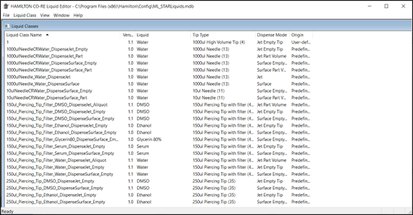  
    <small> Figure 8. View of the Hamilton CO-RE Liquid Editor. This contains all the liquid classes that are imported as well as all default Hamilton liquid classes. </small>   
12.	Under "File", select "Import Liquid Classes".   
    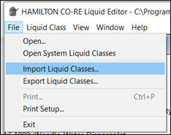  
    <small> Figure 9. User view in the Liquid class editor to import liquid classes.  </small>   
13.	Select the file DROP_Liquid_Classes.mdb when prompted to Open File. The liquid classes in the file will load on the left hand side under "Available liquid classes". Select "Add all" to move them into the "Selected liquid classes" column. Then select "OK".  
    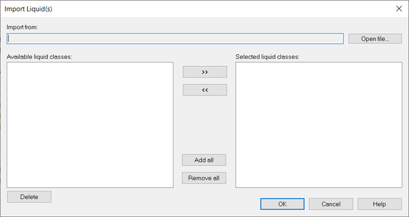  
    <small> Figure 10. User view of the liquid class import page at the start. </small>   

    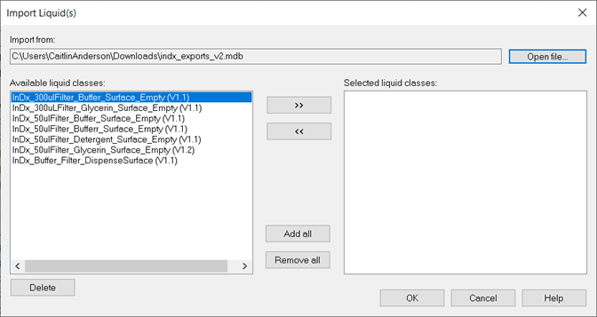  
    <small> Figure 11. User view of the liquid class import page once the .mdb file has been loaded into the "Import from" bar. </small>   

    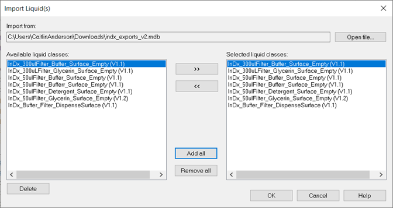  
    <small> Figure 12. User view of the liquid class import page once all of the liquid classes have been selected to be imported. </small>   
     
14.	Once complete, the new liquid classes can be found in the list of Liquid classes. Verify that is the case and close the Hamilton CO-RE Liquid Editor.  

## Import shortcuts 
15.	Import the shortcuts by navigating to the Settings in the VENUS 6 software. Select the "Shortcuts" tab on the upper bar. Select the three lines on the far right.   

    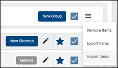  
    <small> Figure 13. User view to import shortcuts into VENUS 6. </small>   

16.	Select Import Items and load the VENUS-Export-Shortcuts.zip file. Once loaded, all of the shortcuts will show up in their respective groupings. Select "Import" and the software will begin importing the selected package(s).   

    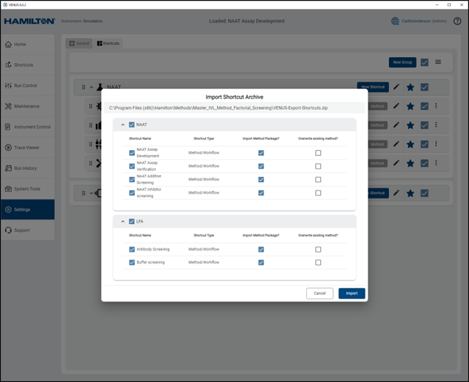  
    <small> Figure 14. User view when shortcuts have been loaded for import. </small>   

17.	Once completed, a pop up window will appear stating "Import Shortcut Complete" with the number of successful imports. 

## Testing installation
1.  To test that the installation was successful, open the VENUS Software. 
2.	Navigate to the Shortcuts bar on the Home page. Select the "..." to the right of the "NAAT Assay Development" Shortcut. 
3.	Select "Simulate Method".
4.	Load one of the test worklists into the pop up. Keep "Animation" selected. Click "ok". 
    - For this test use Test_mastermix_worklist.csv
5.	Load tips onto the virtual deck.
6.	Allow the method to run. Take note of any errors that happen. You can refer to the "Common Errors" tab for assistance. 

  