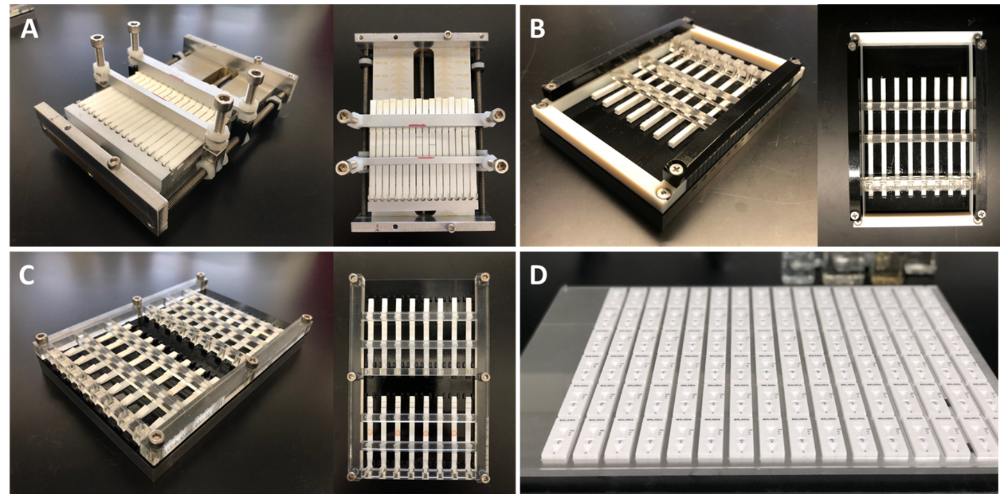
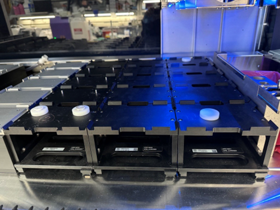
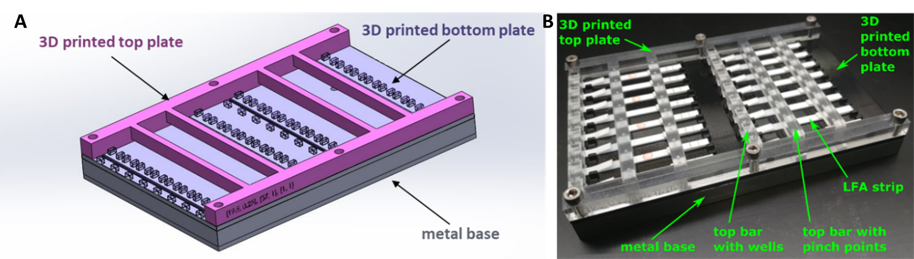
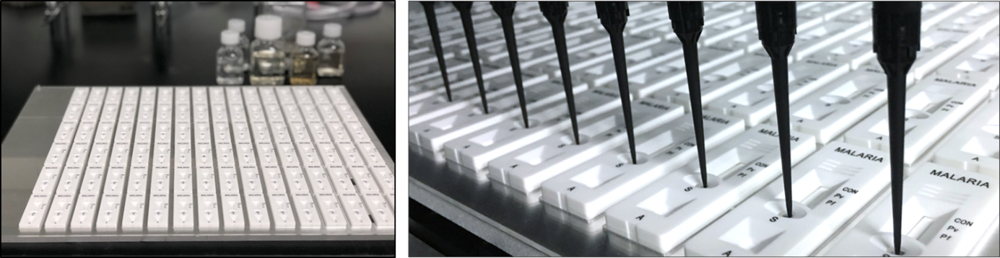

LFAs can come in many different forms. We have developed holders to address two of the most commonly used formats, a strip and a cassette. Other form factors can be integrated, but may require additional development to get a holder that is compatible with both the form factor of the LFA and the form factor of the deck postiions on the Hamilton STAR. These holders may also be adapted to other liquid handling systems. 

  
<small>Figure 1. Image of the developed LFA strip (A), (B), and (C), and cassettes (D) from https://doi.org/10.1007/s00216-022-03897-9</small>

The objective of this document is to describe the pieces of hardware that might be required to operate the DROP system. This includes modifications to the base assembly from Hamilton, machined aluminum trays, laser cut acrylic sheets and 3D printed strip holders. This document has been prepared such that the entire assembly can be understood, as many parts relate to one another in the final deck layout.  

### Custom Deck Modifications

  
<small>Figure 2. Hamilton base carriers that have pegs and spacers added in their desired locations.  Associated parts are described in Tables 1 and 2.</small>

**Table 1.** Assembly of Hamilton base carriers that are modified so they can provide fiducial markers when LFA or cassette holders are placed on top. 

| No.| File Name       | Description    | Vendor             | Qty   | Modified | Link |
| :- | :-------------- | :------------- | :----------------  | :--: |:-------- |:---: |
| 1  | 047284.SLDASM   | Base assembly  | Hamilton Robotics  | 3     |          |      |
| 2  | 047283.SLDPRT   | Carrier base   | Hamilton Robotics 188039/00 | 1     |          | 1    |
| 3  | 047279.SLDASM   | Hamilton stand | Hamilton Robotics  | 3     |          | 1    |
| 4  | 047274.SLDPRT   | Top plate      | Hamilton Robotics  | 3     | Pin holes added | 3 |
| 5  | 047275.SLDPRT   | Leg            | Hamilton Robotics  | 2     | No       | 3    |
| 6  | 047281.SLDASM   | Hamilton stand | Hamilton Robotics  | 1     |          | 1    |
| 7  | 047273.SLDPRT   | Top plate      | Hamilton Robotics  | 1     | Pin and threaded holes added| 6 |
| 8  | 047275.SLDPRT   | Leg            | Hamilton Robotics  | 2     | No       | 6    |
| 9  | 047282.SLDASM   | Hamilton stand | Hamilton Robotics  | 1     | No       | 1    |
| 10 | 047277.SLDPRT   | Top plate      | Hamilton Robotics  | 1     | No       | 9    |
| 11 | 047275.SLDPRT   | Leg            | Hamilton Robotics  | 2     | No       | 9    |

**Table 2.** Alignment posts and spacers to enable correct assembly. A * in the No. column indicates that GH Labs will be providing this part.

| No.| File Name       | Description    | Vendor            | Qty  | Modified | Link  |
| :- | :-------------- | :------------- | :---------------- | :--: |:-------- |:-----: |
| 12 | 047288.SLDPRT   | Alignment posts| Custom            | 2    |          | 1 + 16 |
| 13 | Hamilton_spacer.SLDPRT | Spacers | Custom            | 2    |          | 1 + 16 |

Note: Hamilton_spacer.SLDPRT doesn’t correctly account for tolerances, there is a need for us to improve the file to account for tolerances if this part is 3D printed.

### RoboLFA Strip Holder 
An LFA strip holder is helpful when a cassette has not yet been designed or the LFA dimensions are still requiring adjustment. Some LFAs on the market are in strip form, such as *Milenia Biotec HybriDetect Universal Lateral Flow Assays* and over-the-counter HCG tests, and therefore would stay in this category throught the entire research and development lifecycle. On this site we will mostly discuss our most commonly used strip holder, which consists of the following:

- Aluminium plate (dimensions) with six holes compatible with (size) screws  
- 3D printed base plate designed to fit the dimensions of the LFA  
- 3D printed top plate designed with necessary pinch points, wells for reagent addition, and read window   
- 6 Screws (size)

When starting a new RoboLFA effort, it is critical to understand the requirements for a strip holder. This includes the length and width of the strip, the location and thickness of pinch points, the location and volume required for reagent addition, and the location and size of the read window. Each of these factors can be modified in the CAD files linked below. More detailed instructions can be found [here](NEED TO ADD A LINK HERE). 

  
<small>Figure 2. Strip holder to hold non-cassetted LFAs. The designed holder consists of three parts, (1) an aluminum base plate, (2) 3D brinted base plate and (3) 3D printed top plate. The bottom plate is designed with guide posts for consistent placement of a strip, while the top plate is designed to have pinch points and wells where required. Image from https://doi.org/10.1007/s00216-022-03897-9</small>

**Table 3.** LFA Strip Holder which consist of an aluminum base onto which 3D printed pieces are screwed. Similar to the RoboLFA Cassette Holder, The size and spacing of the strips can be varied depending on the need of the specific LFA. The dimensions of the wells, pinch points, and read windows can all be modified as needed. We typically have used ABS (acrylonitrile butadiene styrene) for this part. A * in the No. column indicates that GH Labs will be providing this part.

| No.| File Name       | Description    | Vendor            | Qty  | Modified | Link  |
| :- | :-------------- | :------------- | :---------------- | :--: |:-------- |:-----: |
| 14 | 047286.SLDPRT   | LFA strip holder base | Custom            | 1-5  |          | 1 |
| 15 | 056923.SLDPRT (LFA Holder 3)| LFA strip top+bottom frame|Custom| 1-5  |          | 14|

CAD files can be found here: 

We have two other versions of the strip holder that have some usability issues that need to be addressed. The other two strip holders are either challenging to set up reproducibly or require additional engineering on the clamping mechanism. More details about both of these holders can be found in the [supplemental material](https://doi.org/10.1007/s00216-022-03897-9). 
If we were to get additional time to further improve the strip holders, the most exciting holder is the lego inspired assembly that allows for different 3D printed cross bars to be added interchangeably in 0.5mm increments along the length of the holder. 

### RoboLFA Cassette Holder
An LFA cassette holder is used when the strip dimensions have been locked and is further along the R&D pipeline. The cassette holder has defined spacing, allowing for precise liquid delivery and imaging across a large number of LFA devices.  

The cassette holder consists of:  

+ A 1/4" aluminum plate (40 x 48 cm) with the following modifications  
    - Two pins to guide the acrylic sheet in place  
    - Two drilled holes (dimensions) that enable consistent placement of the cassette holder onto the Hamilton Deck  
+ A 1/16" acrylic sheet (40 x 48 cm) with the following modifications
    - Laser cut to fit the cassette dimensions (example CAD files fit 80 and 96 cassettes respectively)
    - Two pin holes to guide ont othe aluminum plate 

  
<small>Figure 3. Holder for cassetted LFAs. The designed holder consists of two parts, (1) an aluminum base plate, (2) a laser cut 1/16" acrylic sheet designed to fit cassettes with little "wiggle room".  Image from https://doi.org/10.1007/s00216-022-03897-9</small>

| No.| File Name       | Description    | Vendor             | Qty  | Modified | Link  |
| :- | :-------------- | :------------- | :---------------- | :--: |:-------- |:-----: |
| 16 | 047287.SLDPRT   | LFA cassette deck| Custom            | 1    |Holes for alignment posts and posts for cassette holder| 12 + 13 |
| 17 | 038379_v1.SLDPRT or  038379_v2.SLDPRT (LFA Holder 4) | LFA cassette holder | Custom            | 1    |Holes for posts and cassettes (LFA cassette dependent)| 16 |

:simple-opensourcehardware: 

## Deck build 

The hardware above is placed onto the deck in the following, respective manners, for the cassette and strip holders. 

  
<small>Figure 4. Deck layout with cassette holder and corresponding guidance spacers. </small>

Images of deck build with both the LFA strip holder 

  
<small>Figure 5. Deck layout with strip holder. </small>