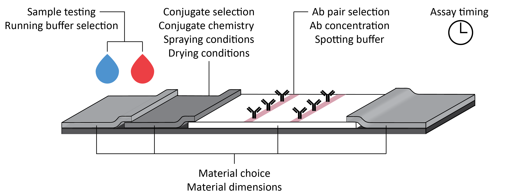
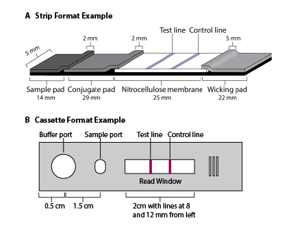

The DROP workflow, diagrammed in Figure 1 below, includes experimental design, experiment setup, experiment validation, running the experiment, and data analysis. This document specifically covers the procedures for Steps 3 and 4: experiment validation and running the experiment. Additional information about assay specific worklist generation and data analysis can be found in their respective pages. 

  
<small>Figure 1. High level overview of the DROP workflow. This workflow includes (1) Experimental design (2) Experiment setup (3) Experiment validation (4) Running an experiment and (5) Data analysis. In most applications, futher iteration would continue until product criteria are met.  </small>

## :octicons-checklist-16: **Experiment Checklist**

***Preparing for the experiment:***  

1. Design experimental protocol 
2. Design, source, and build LFA components 
3. Identify and define additional liquid classes or hardware requirements within the Hamilton software, if needed  
4. Source appropriate reagents, pipette tips, plates, LFAs, and custom LFA-specific hardware  
5. Generate experiment worklist file  
6. Validate worklist file in simulation mode within the Hamilton software 
7. Make modifications to worklist as needed   
*Note plate locations and number of tips used*  

***Running the experiment:***  

1. Prepare Hamilton STAR instrument deck   
2. Spray down deck with cleaning solution  
3. Complete Daily Maintenance. Skip, if already completed for the day.   
4. Load all required tips onto instrument  
5. Load reagents and samples into corresponding plates    
6. Place all reagent plates, sample plates, LFAs and associated custom LFA-specific hardware onto Hamilton STAR instrument deck  
7. Run worklist(s) on Hamilton STAR using Hamilton software  

***Finalizing experiment:***  
1. Verify data has been acquired and saved in appropriate folders  
2. Clean up Hamilton STAR instrument deck, reusable custom LFA-specific hardware, and dispose of materials appropriately  
3. Analyze data using GH Labs image analysis software  
4. Prepare documentation of results and analysis   

## Experimental design

Experimental design on the RoboLFA system 

  
<small>Figure 2. Examples of variables that can be optimized using the RoboLFA system. </small>

## Experiment setup

An LFA effort on the DROP system begins by preparing the hardware and software for a given assay. Most often, we'll start with a strip or cassette with specific dimensions that correspond to the overall size of the assay, the pipetting location(s), and the read window. 

  
<small>Figure 3. Examples of a strip LFA (A) and cassetted LFA (B) with some example dimensions that may be required. Not pictured are the height dimensions that are important when programming pipetting steps. It is recommended to measure using a caliper or other highly accurate measurement tool. </small>

For a given LFA, make sure to take note of the important x, y, and z locations that will need to be incorporated for the hardware and software. 

### :simple-opensourcehardware:  **Adjusting hardware for LFA**

#### Cassette holder adjustments 

The cassette holder is made from laser cut acrylic that has a grid to consistently space cassettes inside the deck of the Hamilton STAR. To modify for a given LFA, start by measuring the width and the length of the LFA cassette. Make adjustments to the CAD file (link) so that the cassette can fit inside the rectangle cut from the acrylic. Make sure to keep the spacing between rectangles consistent in both the x and y dimensions, as this will be important when making labware adjustments. 

#### Strip holder adjustments 

### :simple-opensourcehardware:  **Adjusting labware definition for LFA**

### :material-image-auto-adjust: **Adjusting RADA for strip**

### :material-camera: **Adjusting imaging for strip** 

### :fontawesome-solid-droplet: **Optimizing liquid classes**

The DROP system has a library of liquid classes that can be used to run experiments. These liquid classes are modified to have the precise pipetting protocol to enable consistent pipetting for a given liquid class. It is important to precisely tune a liquid class for the liquids that will be pipetted during an experiment on the DROP system. Some of the parameters that are included are flow rate, air transport volume, blowout volume, settling time, and more. More information can be found in the CO-RE Liquid Editor Help section. Liquid classes can be made using the Hamilton Liquid Verification Kit (LVK). When more liquid classes are made, or when an existing liquid class is validated for a new liquid, they will undergo performance qualification. The list below includes liquid classes used commonly for the LFA system. 

| Liquid Class           | Tip size | Dispense Type     | Recommended validation for: |
| :-------------- | :-------------------- | :------------------- | :------------------- |
| RoboLFA_tip50_spot_JetEmpty | 50|Jet Empty | Antibody and conjugate solutions |
| RoboLFA_tip300_buffer_JetEmpty | 300|Jet Empty | LFA running buffer |
| RoboLFA_tip300_buffer_SurfaceEmpty | 300|Surface Empty | LFA running buffer |
| RoboLFA_tip50_buffer_JetEmpty | 50|Jet Empty | LFA running buffer |
| RoboLFA_tip50_buffer_SurfaceEmpty | 50|Surface Empty | LFA running buffer |
| RoboLFA_tip50_plasma_JetEmpty | 50|Jet Empty | Plasma or similar |
| RoboLFA_tip50_plasma_SurfaceEmpty | 50|Surface Empty | Plasma or similar |
| RoboLFA_tip50_water_JetEmpty | 50|Jet Empty | Water |
| RoboLFA_tip50_water_SurfaceEmpty | 50| Surface Empty | Water |

Once all of the above activities have been completed, the system is ready to run an LFA effort. An example checklist is shown below to step through the process from beginning to end. 

### Generate worklist(s) 

Worklists can be generated using the Robotic Assay Development Application (RADA) or through manual methods. An explanation on how to make a worklist using either method can be found in the RADA tab. 

## Experiment validation

!!! note     
    All worklists must first be run in simulation mode to identify any potential problems before running the actual experiment. Use simulation mode to do the following: 
    - Verify run by watching the deck layout.
    - Optional: verify run using the trace file.
    - Optional and recommended: add animation in the method. The animation provides realistic virtual x, y, z visualization.

1. To validate the worklist(s) generated for the experiment, first launch VENUS software 
2. Using the three dots on the right-hand side of the relevant shortcut to access the menu, in either the “Frequently Used” portion of the window or the “Shortcuts” section, select “Simulate Method”. Once selected, Run Control will open and prepare to run the method in simulation mode.  

  
<small>Figure 4. Navigation to enter Simulation Mode in VENUS 6 software. </small>

3. Confirm that the system is in simulation mode in the upper left corner of the window. Once confirmed, click the blue play button to begin the simulation. 

  
<small>Figure 5. In Run Control, the mode can be viewed by noting the name listed next to “Instrument”.  In simulation mode, the programmed steps will not be sent to the machine itself. Instead they are sent to a virtual machine that simulates the entire method. In instrument mode, the programmed steps will be sent to the machine. All worklists should first be validated in simulation mode. </small>

4. The following setup pop-up will appear. Select the worklist file for this experiment by clicking on the “…” button and navigating to the specific file. Once the worklist is loaded, the “Run” button will become active. Click “Run”. 

  
<small>Figure 6. Pop-up window once the method is started. Load the worklist file from a location on the local machine. Animation can be selected or deselected depending on operator preference. Click the “Run” button to start the operation.</small>

!!! note 
    The worklist file must be a .csv file that ends with worklist.csv. If the file is of another type, the Hamilton software will not recognize it. 

    **Developer notes:** The Hamilton Method was developed in collaboration with the Hamilton Apps team. It inputs a *worklist.csv file where each row in the document corresponds to one robot step. The method file is intended to be flexible for a range of experimental designs. More information about this document, called a “worklist” can be found in the RADA tab.

5. Tip counters will appear. Update the tip count for all tip types by clicking on the first available tip in each rack. Make sure to be precise. If there are not enough virtual tips, the Method will error.  For simulation, the best practice is to fill all locations of each tip type. This will inform the total number of tips that must be loaded onto the instrument when running the experiment. Click “OK” when done. 

  
<small>Figure 7. Example pop-up windows that appear to indicate what tips are present on the deck. Make sure enough tips are loaded virtually to cover the steps written in the worklist. This can be checked in Simulation Mode.</small>

6.  Run simulation and observe for any potential errors. 
!!! note 
    - Errors in the worklist can prevent the method from running to completion, and a notification will appear with information to fix the error. 
    - Common errors include having the wrong liquid class for the volume or dispense type selected, choosing a location that doesn’t exist on the deck, or having incorrect group numbering. Other errors will allow the worklist to run without errors but still indicate a problem with the worklist. These errors are typically due to incorrectly noting the plate or well number on the deck. More information about these errors can be found in the Troubleshooting section.
    - There are a few different windows that can be present during simulation.  It is recommended to focus on the “Instrument” window and the “Traces” window. These two windows will allow the operator to see what is happening and identify the cause of any potential error.  
    *Note: The other optional windows that can be included in the simulation view are the “Activities” and “Scheduler” windows, however these are not useful for the current methods.*
    - The length of the simulation will depend on the type and number of steps included in the worklist. 

  
<small>Figure 8. Run Control when the method is running.</small>

7. Verification and troubleshooting: 
    - If everything ran correctly, a “Method Complete” message will appear. If not, an error message will pop up. 
    - Note the error and open the logfile to get more information. Once the issue has been identified, refer to the DROP Troubleshooting: Quick Guide document for common problems and how to fix them. 
8. Note the plate and tip locations. 
    - If the run is completed successfully, note the location of the plates and tips used. 
    - It is recommended to take a screenshot and save it into a virtual laboratory notebook to assist with experimental set up. 

  
<small>Figure 9. Example screenshots of methods run on the Hamilton Method. An ideal screenshot will show both the number of tips used and the plate locations that are required.</small>

## Running an experiment 

1. Run daily maintenance. Before running an experiment. To do so, launch the Instrument Maintenence Program and follow the step by step instructions provided. 
2. If required, turn on the cooling pump at least 1 hour before the experiment to ensure that the carreirs have reached the required temperature. Make sure there is enough liquid in the chiller. 
3. Wipe down the deck with an appropriate cleaning solution. 
4. Add a new biohazard bag intot he waste container. 
5. Ensure there are no potential obstructions to the movement of the channels. 
6. Set up labware according to the deck layout as required by the corresponding Layout and Worklist files. 
7. Load pipette tips into their respective locations. The number of tips required can be determined from the simulation run. 
8. Load all reagents and materials onto the deck. Verify that each piece of labware fits correctly. 
9. Close the front shield of the instrument and verify there is no interference nearby. 
10. Open VENUS software and return to the Home Page in the Navigation Bar. Load the method by selecting the shortcut or by choosing from "Run History". 
11. Confirm that VENUS software is in insturment mode by noting the name listed next to "Instrument" in the Run Control Window. 

  
<small>Figure 10. The view in Run Control when an experiment has been started in instrument mode. Note the machine’s ID to ensure that the system is connected to the Hamilton STAR.</small>

12. Select the blue play button to begin the run. 
13. The pop up shown in figure X will appear. Attach the worklist file that corresponds to the experiment and select "Run". 

!!! note 
    The method can be run with or without animation when in instrument mode. 

14. Using the information gained from simulation mode, verify the number of tips loaded for the experiment. Update tip count for all tip types by selecting the first available tip in each rack. Make sure to be precise. Select "ok" when done. 
15. Run the method, watching the instrument and/or the trace for any potential errors. The first time a new worklist is run, stay by the instrument in case of an incident. Should a problem arise, select either the “Pause” or “Abort” buttons in the run control window. 

!!! note 
    Make sure there are enough pipette tips on the deck for the experiment programmed. The system will not notice that there are not enough tips until it runs out.   

16. If an error message appears, refer to the Troubleshooting section for assistance. 
17. Clean up:
    - Remove all consumables except for tips from the deck. 
    - Seal all plates (especially any plates containing template) and place immediately in biohazard. 
    - Remove biohazard bag, tie, and place immediately in biohazard bin. 
    - Spray down deck with ethanol and/or bleach (experiment/sample dependent)
    - Clean up any spills and debris, as necessary. 
    - Turn off the cooling pump if used. 

!!! note "General Precautions"
    - Do not insert arms and hands when the robot is running. 
    - Do not switch tubes around once processing has begun. 
    - Do not reuse tips that have been discarded into the waste.
    - Do not empty the tip waste while the instrument is running. 
    - Do not leave tips on the pipetting channels for extended periods (such as overnight).
    - Shield the instrument from direct sunlight or intense artificial light. 
    - Do not place anything on the deck higher than 145mm above the deck’s surface.
    - Close the front cover during the run. The front cover is monitored by software and will abort the method if left open. 
    - Low volume (10µL) tips do not reach the deck or the bottom of sample tubes in standard sample carriers
    - Load tips correctly. 50µL and 300µL tips have the same shoulder height and cannot be used interchangeably.
    - Depending on the assay, certain chemistries are more stable on the deck when stored at 4°C than others. Additional chemistry specific testing may be required. 

## Data analysis 

Analyze data as described in the LFA Software tab. Repeat process as required. 

