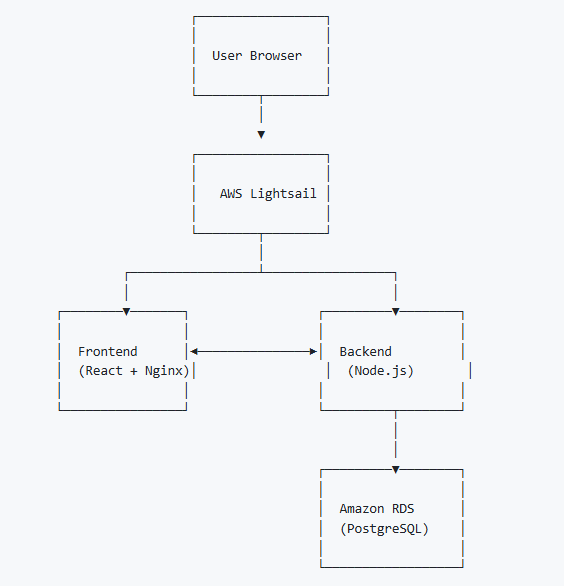

## Custom Software

### Method and Layout Files

:fontawesome-brands-github: - RoboLFA Files 

The Hamilton Method designed by GH Labs was built with the goal of ultimate flexibility when it came to running LFA or NAAT experiment. The Method consists of 10+ Submethods that enable the user to input a worklist where every row is a single command being sent to the robot. These commands can include liquid movement, imaging, and plate movement (iSWAP specific) steps with the option to fix timing and grouping as needed. The LFA and NAAT methods are identical, but their layout files are different. Each implementation of the DROP system may require reconfiguration of the Layout file depending on the system. 

This deck layout was designed for running lateral flow assays and rapid diagnostic tests. These assay/tests can be in either strip or cassette form. There are specific holders for each so that their locations are consistent. For most LFAs, nesting tip racks (NTRs) can be used to maximize the available space on the deck for cassettes or strips. 

  
<small> Figure 1. Description </small>   

#### Plate Locations
The deck layout has been defined with the following labware in their respective positions. To use all of these deck locations, the Hamilton flat plate adapter needs to be added to locations 1-9. For most experiments, these will not be required as the only plates used will be in locations 11-14. 

| Updated Labware IDs        | Position      | # wells       |
| :------------------------- | :-----------: | :-----------: |
| flat_reservoir_0003        | 1             | 1             |
| flat_384_0003              | 2             | 384           |
| flat_96_0003               | 3             | 96            |
| dw_96_0003                 | 4             | 96            |
| empty                      | 5             | NA            |
| flat_reservoir_0002        | 6             | 1             |
| flat_384_0002              | 7             | 384           |
| flat_96_0002               | 8             | 96            |
| dw_96_0002                 | 9             | 96            |
| empty                      | 10            | NA            |
| flat_reservoir_0001        | 11            | 1             |
| flat_384_0001              | 12            | 384           |
| flat_96_0001               | 13            | 96            |
| dw_96_0001                 | 14            | 96            |
| empty                      | 15            | NA            |

#### Plate Information

The deck layout has been defined with specific plates. More information about each plate type is included below. 

| Plate ID        | Description      | # wells       | Example Part #s     |
| :-------------- | :---------------------------------- | :-----------: | :---------------------------- |
| flat_reservoir  | Reservoir for multichannel use. Requires high dead volume and therefore is not recommended for most uses.| 1 | Millipore Sigma # HS120637 or ThermoFisher # 15075|
| flat_384  | Flat bottom plate with 384 wells. V and U bottom wells can also be used here.| 384 | Greiner Bio-One # 781900 or 781901|
| flat_96  | Flat 96 well plate. V and U bottom plate can also be used here.| 96 | Greiner Bio-One # 650901, 651901, 655900, or 655901|
| dw_96  | Deep well plate with 96 wells.| 96 | Greiner Bio-One #780261 or Hamilton #’s 6471-01 and 235656|

The product information is for examples of plates and reservoirs that have been used previously. If the plate follows SBS plate format it should be functional in this plate layout. 

#### Pipette Tips 
The deck layout has been defined with the following pipette tips on the deck. 

| Pipette tips  | # racks on deck | # tips on deck | Locations   | Hamilton Product # |
| :------------ | :-----------: | :-----------: |:-----------: |:-----------: |
| 50 uL partial | 1             | 96            | A            | 235948, 235979 or 235978 |
| 50 uL full (NTR) | 20         | 1,920         |K, L, M, N, O | 235987 |
| 300 uL partial | 1            | 96            | B            | 235903, 235937 or 235938 |
| 300 uL full (NTR) | 20        | 1,920         | F, G, H, I, J| 235985 |
| 1000 uL partial | 3           | 288           | A            | 235905 or 235940 |

#### LFA Holders
The deck layout has been defined with space for one of the following LFA or RDT holders positioned at a time. More information on these LFA holders can be found in the Software section for roboLFA.

| LFa or RDT Holders                                   | Position      | # wells       |
| :--------------------------------------------------- | :-----------: | :---------------: |
| IVL_Plate_v2a_16strips_plastic_col_first_0001 to 012 | LFA Bay       | Increments of 8   |
| IVL_Plate_v3_96cassettes_ABformat_0001               | LFA Bay       | 96                |
| 038379_v2.SLDPRT                                     | LFA Bay       | 80                |

### RADA

:fontawesome-brands-github: - RADA App Frontend   
:fontawesome-brands-github: - RADA App Backend  
:fontawesome-brands-github: - RADA App Deployment  

The RADA Web Application was designed to improve the user experience with generating worklists. For this web application, the user inputs their experimental details at a higher level, and the software outputs the corresponding worklist file(s) and instructions on how to load the deck with the appropriate reagents. 

There are three different Github repos associated with RADA, the frontend, backend, and deployment. All three are required to deploy the web application. The Deployment Repo contains all necessary information to deploy the RADA web app. 

  
<small> Figure 1. Description </small>   

#### Project layout

    mkdocs.yml    # The configuration file.
    docs/
        index.md  # The documentation homepage.
        ...       # Other markdown pages, images and other files.

### LFA image analysis 

:fontawesome-brands-github: - LFA Image Analysis 

#### Project layout

    mkdocs.yml    # The configuration file.
    docs/
        index.md  # The documentation homepage.
        ...       # Other markdown pages, images and other files.

