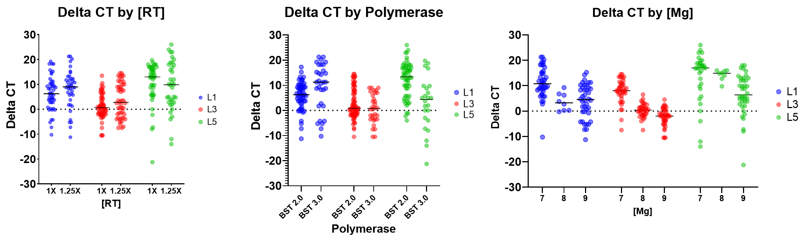

The DROP system can provide utility for a range of efforts in research and development for NAAT assays. RoboNAAT, as it has been affectionately named, has been built out to enable large scale experiments for PCR as well as isothermal amplification methods. An example effort for a SARS-CoV-2 loop mediated isothermal amplification (LAMP) assay is described in this document. 

LAMP is an isothermal amplification method that relies on 4-6 primers to amplify a DNA or RNA target at a steady temperature, usually between 60-65C. The chemistry also utilizes a DNA polymerase with strand-displacing properties to allow for effective amplification. Different from PCR, which produces a predictable amplicon, LAMP amplicons can form many different structures. This provides both an advantage, for example in the probability, as well as a challenge, such as the possibility of off-target amplification. 

Therefore, this chemistry was ideal for optimization on the RoboNAAT system as traditional one factor at a time (OFAT) optimization may not capture the full picture of a given LAMP assay. In this example, (1) Mastermix optimization, (2) additive screening, and (3) assay evaluation are all demonstrated with their example worklists and results. 

  
<small>Figure 1. High level overview of the NAAT optimization efforts described in this page. The efforts were broken into (1) mastermix optimization, (2) additive screening and (3) performance evaluation. </small>

## :simple-graphql: **LAMP Mastermix Optimization Effort**

### Experimental Design

The first step in the optimization process for the SARS-CoV-2 LAMP assay was to optimize the best reagents and optimal concentrations for:

- Polymerase (NEB BST 2.0 or 3.0)
- Reverse transcriptase (Omniscript RT or NEB WarmStart RTx)
- Primer sets (L1, L3, and L5)
- Magnesium 

A definitive screening design (DSD) was used to determine the reagent conditions that gave the fastest time to positive without increasing off-target amplification. Using JMP software, the anticipated power for all variables tested was estimated to be between 0.99 and 1. 

The starting mastermix conditions (as informed by NEB) were used as the control and was included on every plate. A total of 84 mastermixes were run including the control mastermix included across six PCR plates. For each mastermix, four technica replicates were run for both negative and positive (1000 copies/uL). 

### Reagent Preparation

Three LAMP primer sets were designed using Geneious software and published sequences of the SARS-CoV-2 genome. Primers were ordered from IDT. 

Reagents required for this effort included:

- 10X Isamp buffer
- MgSO4 diluted to 100mM working stock
- dNTP mix (NEB)
- Nuclease free water
- Evagreen (20X)
- NEB BST 2.0 and 3.0
- Omniscript and NEB Warmstart RT
- Primers (IDT)
- PCR plates
- PCR plate seals 

### Worklist Preparation and Validation

Worklists were prepared to run the experiment as designed by JMP. This effort was run using 96 well plates and prepared two at a time. The worklists for preparing the mastermix and aliquoting sample were seperated to enable sample preparation to occur while the mastermix is being run. This effort could be accelerated by using a 384 well plate or if there are more thermocyclers available. 

*Run 1*
:material-microsoft-excel: [Make, mix, and aliquot mastermix](./worklists/A1A_makeandmix_worklist.csv)
:material-microsoft-excel: [Aliquot Sample](./worklists/A1A_template_aq_worklist.csv)

*Run 2*
:material-microsoft-excel: [Make, mix, and aliquot mastermix](./worklists/A1A2_makeandmix_worklist.csv)
:material-microsoft-excel: [Aliquot Sample](./worklists/A1A2_template_aq_worklist.csv)

*Run 3*
:material-microsoft-excel: [Make, mix, and aliquot mastermix](./worklists/A1A3_makeandmix_worklist.csv)
:material-microsoft-excel: [Aliquot Sample](./worklists/A1A3_template_aq_worklist.csv)

*Run 4*
:material-microsoft-excel: [Make, mix, and aliquot mastermix](./worklists/A1A4_makeandmix_worklist.csv)
:material-microsoft-excel: [Aliquot Sample](./worklists/A1A4_template_aq_worklist.csv)

For all four of these runs, they have similar deck layouts. Examples of the wells and plates used for both worklist types are in the images below. 

  
<small>Figure 2. Deck layout from the make, mix, and aliquot worklist after running in simulation. </small>

  
<small>Figure 3. Deck layout from the sample aliquot worklist after running in simulation. </small>

All reagent plates were prepared with the reagents detailed in the worklist viewer in the RADA app. This includes all mastermix components and samples (negative and positive). Tips were loaded onto the deck corresponding to the number identified in the simulation run. The validated worklist(s) were then run on the Hamilton STAR using the VENUS software.

### Results and Conclusions

From this screening effort, 31 formulations were found to have better performance than the control mastermix. 

  
<small>Figure 4. Snapshot of the data generated from the Definitive Screening Design to identify optimized conditions for the SARS-CoV-2 LAMP assay. </small>

There were three larger trends that were identified from this screening effort:

- Increasing the reverse transcriptase concentration has little impact on time to result for all three primer sets tested
- BST 3.0 polymerase helps with reaction speed for primers set 1, but not 3 or 5. 
- Primer sets 1 and 3 amplify faster at 7mM Mg, where set 5 does not have as strong of a response. 

From this effort, the 80+ mastermixes allowed an increased understanding of the LAMP chemistry. The two top performing assay conditions were selected and used for additional testing. 

## :material-graph: **LAMP Additive Screening Effort**

### Experimental Design

The Additive Screening round had a few goals, specifically to identify the impact of a list of additives on the speed, tolerance to inhibihors, or stability of the assay. Most additives included in this screen fall into three categories:

1. Stability and blocking 
2. Crowding agents 
3. Melting temperature (Tm) and secondary structure reducers 

Because of the differing nature of each of these categories, the experimental design included mastermixes tested with one additive at a time at two concentrations, as well as a DSD design testing combinations of the additives in the stability and blocking category. 

### Reagent Preparation

In addition to the reagent preparation described in the previous effort, a long list of additives and crowding agents were identified for screening. These reagents include:

**Stability agents:**

- Sucrose
- Trehalose 
- BSA

**Crowding agents:**

- PEG (1000, 3000, and 8000)
- Ficoll (400)
- Dextran (12k, 80k, and 410k)

**Tm and secondary structure reducers:**

- Formamide
- Betaine
- DMSO
- SSBs 

**Miscellaneous:**

- ATP
- Guanidine
- EDTA

### Worklist Preparation and Validation

The additive screening was split into three robot runs, preparing two 96 well plates each run. Examples of the worklists are included below for the first two runs. 

*Run 1*
:material-microsoft-excel: [Make, mix, and aliquot mastermix](./worklists/2a_makeandmix_worklist.csv)
:material-microsoft-excel: [Aliquot Sample](./worklists/2a_template_aq_worklist.csv)

*Run 2*
:material-microsoft-excel: [Make, mix, and aliquot mastermix](./worklists/2b_makeandmix_worklist.csv)
:material-microsoft-excel: [Aliquot Sample](./worklists/2b_half_template_aq_worklist.csv)

### Results and Conclusions

The additive screening was highly informative to understand what factors impacted time to amplification, the presence of off target amplification, and the tolerance to stability agents that may be required for lyophilization. 

  
<small>Figure 5. Snapshot of the data generated from the Additive Screening to identify optimized conditions for the SARS-CoV-2 LAMP assay. </small>

The quantity of data generated in such a short amount of time highlighted the need for good processes for data analysis and interpretation. Some example observations that were made are included below. 

Stability agents:

- Trehalose and sucrose slowed the reaction slightly at 2.5%, but performance was restored at higher concentrations (5%). 
- BSA at 2% destabilized the reaction and increased variability.

Crowding agents: 

- The crowding agents tested mostly lead to a decrease in time to result (improvements ranging from 5 to 15 cycles for conditions tested), however some conditions had an increase in variability across replicates or an increase in off-target amplification in the negative controls.
- The best improvement was seen from the addition of PEG1K and Dextran 410K, which had average reduction in CT of 15 (with NTCs coming up at ~ 92 cycles) and 15 (w/o NTCs coming up) respectively. 

Secondary structure, Tm reducers, and others: 

- Formamide slowed reaction speed by ~10 cycles.
- Betaine at 40mM had no significant impact on the assay, while 100mM slowed the reaction slightly.
- DMSO had no significant impact on assay at 2 or 5%.
- EDTA at 0.5 and 1.5mM inhibited amplification entirely. This was a surprising result as this reagent has worked great for another LAMP mastermix. 

## :octicons-graph-16: **LAMP Performance Evaluation**

### Experimental Design

The top mastermix condition as determined by the efforts from mastermix concentration optimization and additive screening was evaluated using an LOD against the starting mastermix. The two conditions are:

- Start mastermix: 1X RT, 1X BST 2.0, 8mM Mg
- Optimized mastermix: 1.25X RT, 1.25X BS 2.0, and 7mM Mg 

To generate enough data for the LOD, 8 replicates were run at each concentration tested ranging from 25 - 500 input copies. This range had previously been identified as the dynamic range in which the LOD was likely to be determined.  

  
<small>Figure 6. Informational graphic describing the important concentrations in determining the LOD of an assay. From https://doi.org/10.1016/j.watres.2016.03.026 </small>

### Reagent Preparation

This effort used the same reagents as the mastermix optimization and additive screening efforts. 

### Worklist Preparation and Validation

The performance evaluation was completed with a single robot run. 

:material-microsoft-excel: [Make, mix, and aliquot mastermix](./worklists/NAAT_LOD_makeandmix_worklist.csv)
:material-microsoft-excel: [Aliquot Sample](./worklists/NAAT_LOD_template_aq_worklist.csv)

### Results and Conclusions

From this evaluation, it was identified that the optimized mastermix had a 20 fold improvement in LOD as compared to the starting mastermix, with the optimized mastermix and starting mastermix having LODs of 25 and 500 copies/reaction respectively. This is a significant improvement, and was possible after only a couple weeks of hands on work. Additional optimization efforts in a smaller experimental space may provide even more benefits to LOD and/or time to detection. 

  
<small>Figure 7. Example data from an LOD effort comparing the starting LAMP mastermix to the roboNAAT optimized one. In this effort, the LOD was improved 20-fold from the NEB recommended LAMP conditions. </small>

While this effort only ran 8 replicates for each concentration, the roboNAAT system has also been used to run probit analyses comparing the performance of different mastermixes. A probit analysis typically requires 20 replicates run for each concentration, which can be very challenging to set up manually. 

These efforts, which included mastermix optimization, additive screening, and performance evaluation, are all pieces required when making a NAAT assay. By streamlining and automating these protocols, it is possible to gain more information about a chemistry in less time than using the traditional manual methods. This is particularly powerful as new isothermal amplification methods are developed, to inform research and development efforts and (hopefully) support products making it to market faster. 