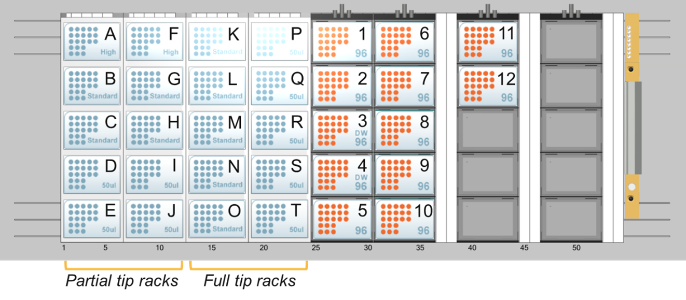

:fontawesome-brands-github: - [RoboNAAT Hamilton Method and Layout File](https://github.com/Global-Health-Labs/DROP/blob/main/sw/Hamilton%20Files/DROP_NAAT_v2.pkg) 

The Hamilton Method, developed by GH Labs, was designed to offer maximum flexibility for executing LFA and NAAT experiments. It comprises over ten modular submethods, allowing users to input a worklist where each row represents a discrete command sent to the robot. These commands may include liquid handling, imaging, and plate movement steps (specific to iSWAP), with configurable options for timing and grouping.

While the core method remains identical for both LFA and NAAT workflows, they differ in their layout files. Each implementation of the DROP system may require customization of the layout file to accommodate system-specific configurations.

This deck layout was specifically designed to support NAAT and other well-based assays. For most NAAT workflows, the use of filter tips is critical to minimize the risk of cross-contamination and ensure assay integrity.

  
<small> Figure 1. Deck layout for RoboNAAT. Specific information about each deck location can be found in the tables below. Modifications can be made to the deck layout in VENUS software. </small>   

### Plate Locations
The deck layout has been defined with the following labware in their respective positions. To use all of these deck locations, the Hamilton flat plate adapter needs to be added to locations 1-9. For most experiments, these will not be required as the only plates used will be in locations 11-14. 

| Updated Labware IDs        | Position      | # wells       |
| :------------------------- | :-----------: | :-----------: |
| flat_96_0001               | 1             | 96            |
| flat_96_0002               | 2             | 96            |
| dw_96_0001                 | 3             | 96            |
| dw_96_0002                 | 4             | 96            |
| flat_96_0003               | 5             | 96            |
| pcr_96_0001                | 6             | 96            |
| pcr_96_0002                | 7             | 96            |
| pcr_96_0003                | 8             | 96            |
| pcr_96_0004                | 9             | 96            |
| pcr_96_0005                | 10            | 96            |
| pcr_384_0001               | 9             | 384           |
| pcr_384_0002               | 10            | 384           |
| template_96_0001           | 11            | 96            |
| template_96_0001           | 12            | 96            |

### Plate Information

The deck layout includes a defined set of plate types, each assigned to specific positions. Detailed information about each plate type is provided below to support proper setup and execution of assays.

| Plate ID    | Description      | # wells       | Example Part #s     |
| :---------- | :---------------------------------- | :-----------: | :---------------------------- |
| flat_96     | Flat 96 well plate. V and U bottom plate can also be used here.| 96 | Greiner Bio-One # 650901, 651901, 655900, or 655901|
| dw_96       | Deep well plate with 96 wells.| 96 | Greiner Bio-One #780261 or Hamilton #’s 6471-01 and 235656|
| pcr_96      | PCR plate with 96 wells.| 96 | Hamilton #814302 or Biorad HSP9601|
| pcr_384     | PCR plate with 384 wells.| 384 | Hamilton #814305 or Biorad HSP3801|
| template_96 | PCR plate with 96 wells (for template ONLY)| 96 | Same as pcr_96|

The product information includes examples of plates and reservoirs that have been successfully used in previous experiments. As long as the plate conforms to the SBS (Society for Biomolecular Screening) format, it should be compatible with this deck layout.

### Pipette Tips 
The deck layout has been defined with the following pipette tips on the deck. 

| Pipette tips    | # racks on deck | # tips on deck | Locations   | Hamilton Product # |
| :-------------- | :-----------: | :-----------: |:-----------:   |:-----------: |
| 50 uL partial   | 4             | 384           | D, E, I, J     | 235948 or 235979 |
| 50 uL full      | 5             | 480           | P, Q, R, S, T  | 235948 or 235979 |
| 300 uL partial  | 4             | 384           | D, C, G, H     | 235903 or 235938 |
| 300 uL full     | 5             | 480           | K, L, M, N, O  | 235903 or 235938|
| 1000 uL partial | 1             | 96            | A              | 235905 or 235940 |
| 1000 uL full    | 1             | 96            | F              | 235905 or 235940 |
