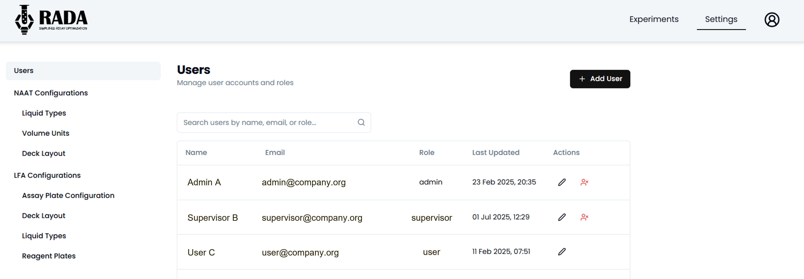
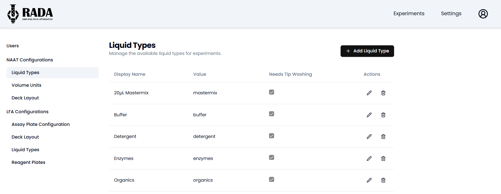
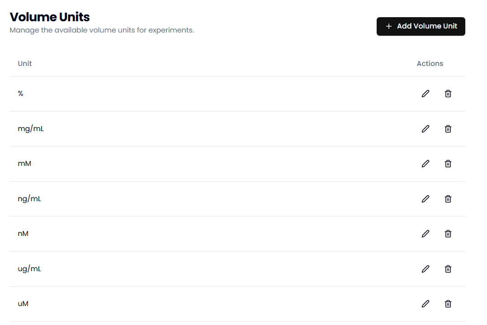
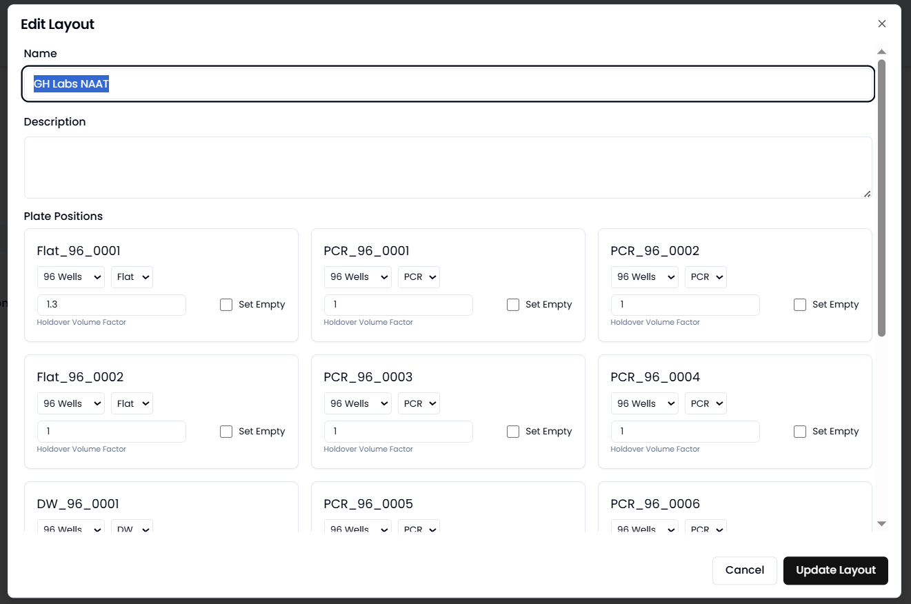
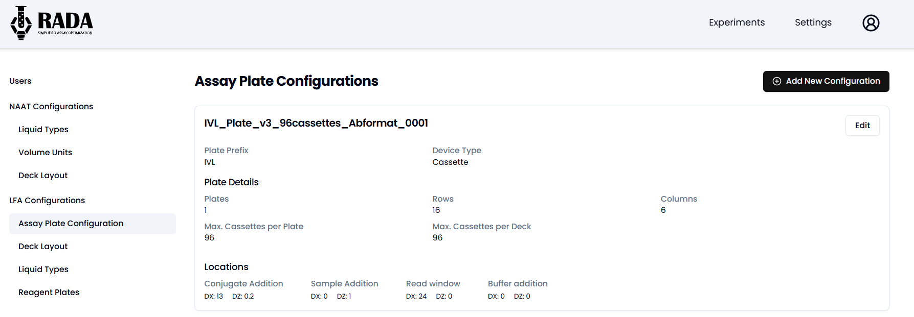

The web application has been designed to minimize the need to re-deploy the application whenever smaller experimental or engineering changes are made to the DROP system. Specific variables required to make the worklist can be generated/modified by admin level accounts in the RADA application. 

The web application should be deployed as described here - :simple-github: [Deployment Repo](https://github.com/Global-Health-Labs/RADA-Deployment)

### :fontawesome-solid-user: **Adding, removing, modifying users**

Once the web application has been deployed, users can be added to the web application at three different levels. Admin, supervisor, and user. Admin users have access to the "Settings" page under which the advanced actions described below can be completed. They can also view/modify experiments made by other Admins, Supervisors, and Users. Supervisors can make experiments and modify experiments made by other users. Users are able to make and modify only their own experiments. 

  
<small>Figure 1. Page to add, edit, and delete users from RADA application. </small>

New users can be added using the "+ Add User" button on the upper right. Once added, the user will receive an email with instructions on how to sign up for the application. 

Users can be modified at any time with respect to their role. They can also be removed as needed. 

### :fontawesome-regular-copy: **Making experimental presets**

The RADA web application has the option to add experimental presets. The app comes preloaded with just a few NAAT presets, but more presets can be added by an admin at any time. 

Presets are intended to simplify the workflow for protocols that are run repeatedly on the DROP system. The presets made will appear under the "New Experiment" drop down. 

  
<small>Figure 2. Example presets for experiments in RADA. </small>

### :material-water: **Modifications to Liquid Types**

Liquid types in the RADA application correspond to liquid classes defined in the Hamilton CO-RE Liquid Editor. The web application only needs a few pieces of information, th ename, value (corresponding to the name in the liquid class) and whether the liquid requires tip washing. Tip washing is recommended for liquids that are highly viscous or may otherwise stick to the inside of the pipette. 

  
<small>Figure 3. Page to add, edit, and delete liquid types from RADA application. </small>

The web application will take the "Value" field and make liquid classes for all three pipette size (50, 300, 1000) and both dispense types (Jet Empty and Surface Empty) used on DROP. When adding new liquid types to RADA, ensure that those liquid classes have been made and validated on the Hamilton STAR to ensure pipetting performance. 

### :material-tape-measure: **Modifications to Volume Units**

Volume units are not used by the backend of the RADA application, but can be helpful for documentation and tracing purposes. Some units have been prepopulated in the application, but others can be added as needed. 

  
<small>Figure 4. Page to add, edit, and delete units from RADA application. </small>

### :material-view-grid-plus-outline: **Modifications to Deck Layout**

Multiple deck layouts can be loaded for both the NAAT and the LFA worklist generator. For each deck layout, there are 15 deck locations available onto which different plate options can be loaded. 

  
<small>Figure 5. Page to add, edit, and delete plates from deck layout in RADA application. </small>

!!! note 
    The loaded plate options MUST correspond to plate locations in the Hamilton Layout file being run.

For each plate position, the user must input the number of wells, well shape, and holdover volume factor. Holdover volume is used to make calculations for the dead volume required. Different plates, depending on their material, shape, and dimensions, will have different holdover volumes. This is best determined through experimentation. 

### :simple-pytest: **Modifications to Assay Configuration Plates (LFA only)**

LFA experiments in the RADA application rely on reagent plates, which are the plates that hold the cassettes or strips. Assay configuration plates have given dimensions and locations for pipetting and imaging. 

New configurations can be added as needed. Each configuration requires:

- Plate prefix: used in the naming convention on the Hamilton Layout
- Device type: Cassette or strip 
- Number of plates: Should correspond to how many of the plates fit on the deck. This will typically be a number between 1 and 15. 
- Rows: Number of rows onto which cassettes or strips fit on the plate 
- Columns: Number of columns onto which cassettes or strips fit on the plate 
- Max cassettes per plate: Typically will be the same number as rows x columns. 
- Max cassettes per deck: Typically will be the max cassettes per plate x number of plates. 
- Locations: these locations correspond to the spots where pipetting and/or imaging should take place. This can be determined empirically based on the strip dimensions but should also be validated experimentally before a real experiment is run. Each location has a dx and a dz value that correspond to the shift in the x and z directions from the origin of the strip. 

  
<small>Figure 6. Page to add, edit, and delete assay configuration plates in RADA application. </small>

