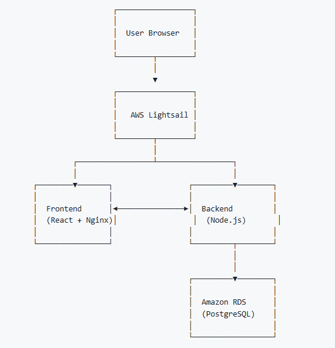

## Robotic Assay Development Application (RADA)

The Robotic Assay Development Application (RADA) was developed to reduce the barrier for entry for users of the DROP system. 

**Key features:**

+ AWS based web application with a built in database
+ Ability to sort by experiment, user, and date created
+ Ability to copy and edit experiments for maximum efficiency
+ Informational icons to support users through unfamiliar jargon
+ Admin functionalities including:
    - Adding new users and changing visibility levels
    - Adjusting liquid classes, hardware, and deck layouts
    - Load experiment presets 
+ Quality assurance tested

### Deployment instructions
:fontawesome-brands-github: - RADA App Frontend   
:fontawesome-brands-github: - RADA App Backend  
:fontawesome-brands-github: - RADA App Deployment  

There are three different Github repositories (repos) associated with RADA, the frontend, backend, and deployment. All three are required to deploy the web application. The Deployment Repo contains all necessary information to deploy the RADA web app. 

  
<small> Figure 1. Description </small>   

### User workflow

1. Input experiment or edit from existing experiment or preset
2. Download worklist file for input into Hamilton Method
3. View robot instructions to load deck
4. Run experiment in simulation 
5. Run experiment on machine and upload results 

### Advanced (admin)

1. Adding, removing, modifying users 

2. Making experimental presets 

3. Modifications to Liquid Types

4. Modifications to Volume Units

5. Modifications to Deck Layout

6. Modifications to Reagent Plates (LFA only)

Older versions of the web application and related code can be found here: **ADD LINK TO LOCATION IN REPO HERE**