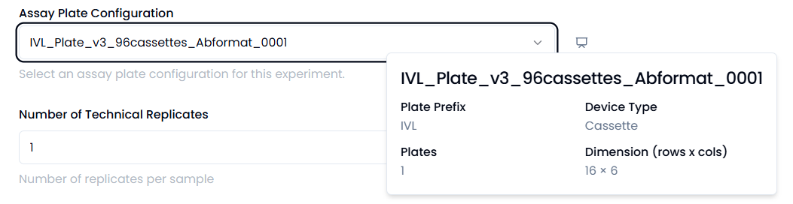

The RADA web application has two experiment tabs, for LFA and NAAT experiments respectively. These are seperated because of differences in the experiment design, specifically around addition to non-plate based hardware. Modifications can be made to widen the breath of protocols that can be generated using RADA, as required.

  
<small>Figure 1. Home page of RADA web application. LFA and NAAT tabs contain experiments for their respective chemistries. </small>

## User Experience - LFA experiment 

Generated LFA experiments can be found in the LFA tab. A new experiment can be generated by selecting "New Experiment" or by copying an existing experiment. 

### Input experimental details

Fill out the information required on the "New LFA Experiment" page (Figure 2). 

  
<small>Figure 2. Create a new LFA experiment allows the user to input information required for a given experiment. </small>

The items that need to be filled out include:

- Name of experiment 
- Deck layout
- Assay plate configuration 
- Number of technical replicates
- Option to make an experiment preset that will appear in the "New Experiment" drop down. 

Both Deck Layout and Assay Plate configuration are drop down menus that pull from configurations built by the RADA admins. More information on what that entails can be found under "Admin Capabilities". 

Assay plate configuration refers to the assay holder (cassette, strip, etc) corresponding to the experiment being run. 

Once the Deck Layout or Assay Plate Configuration have been selected, a preview of the selected configuration will be visible when hovering over the preview icon. 

  
<small>Figure 3. Hover over the icon to preview the selected deck layout. </small>

  
<small>Figure 4. Hover over the icon to preview the selected assay plate configuration. </small>

Once completed, select "Save and Continue". 

The next page allows the user to Configure the LFA experiment steps. The form will pop up with one step, and more steps can be added by selecting the "Add step" button on the bottom right. 

The information required for each step include:

- Step name.
- Liquid type to be pipetted. Select "Imaging" if the step is an imaging step. 
- Volume to be pipetted. Note: Numbers can use decimals and are recommended to be between 1-1000uL for the current configuration. 
- Time delay in seconds if a time delay is required between this and the subsequent step. 
- Variable conditions for the experiment. The worlist generator will take the input variables and use a full factorial DoE to run all combinations of the input conditions. Keep an eye on the number of conditions and number of replicates to ensure that there are enough spots on the given deck layout to run the desired experiment. 

  
<small>Figure 5. Screen to load LFA experiment steps. </small>

  
<small>Figure 6. Screen with an example of loaded experiment steps. </small>

The order of the steps can be adjusted by using the icon with six dots on the left of the Step Name. 

Once the experiment details are finalized, select "Save and Continue"

### Download worklist file(s)

Worklist file can be downloaded from the "Export Experiment" page. This is the file that is input into the Hamilton VENUS Run Control. 

  
<small>Figure 7. Export Experiment Files Page. </small>

!!! note
    The file that is downloaded will be a CSV UTF-8. The Method provided on this site does not work with CSV UTF-8, therefore the downloaded worklist must be opened and saved as a plain .csv. 

### View robot instructions to load deck

When loading the deck, select "View Instructions" to enter into the Worklist Viewer. This viewer contains all the information required for the user to load reagents into plates and plates onto the deck in the correct locations. 

  
<small>Figure 8. Page designed to support the set up of the reagents and plates onto the Hamilton Deck. </small>

After an experiment has been created, it is saved in the database built into the application. An experiment can always be referenced after the fact, as well as modified or loaded with the LogFiles and/or data from the experiment after completion. 

  
<small>Figure 9. Experiment summary for example LFA experiment. </small>

## User Experience - NAAT experiment 

Generated NAAT experiments can be found in the NAAT tab. A new experiment can be generated by selecting "New Experiment" or by copying an existing experiment. Presets for commonly used protocols will also appear here.

### Input experimental details

Fill out the information required on the "New NAAT Experiment" page (Figure 10). 

  
<small>Figure 10. Create a new NAAT experiment allows the user to input information required for a given experiment. </small>

The items that need to be filled out include:

- Name of experiment 
- Deck layout
- Number of samples and technical replicates
- Mastermix volume
- Sample volume
- Liquid type for mastermix liquid
- Liquid type for sample liquid 
- Liquid type for mixing step of mastermix (especially important if the mastermix contents are highly viscous or containing detergent)
- PCR plates size (options for 96 and 384 wells)
- Option to make an experiment preset that will appear in the "New Experiment" drop down. 

Deck Layout is a drop down menu that pulls from configurations built by the RADA admins. More information on what that entails can be found under "Admin Capabilities".  

Once the Deck Layout has been selected, a preview of the selected configuration will be visible when hovering over the preview icon. 

Once completed, select "Save and Continue". 

The next page allows the user to Configure the NAAT experiment steps. Each mastermix will be loaded into one section that can contain as many mastermix components as needed. The form will pop up with one mastermix, and more steps can be added by selecting the "Add mastermix" button on the bottom right. 

The information required for each step include:

- Mastermix name
- Source name: user input reagent name
- Concentration unit 
- Final concentration desired in mastermix
- Stock concentration: starting concentration for reagent
- Liquid type to be pipetted

The order in which the reagents are added into the list is the order in which they will be added on the machine. If the order needs to be switched, they can be moved by using the six dots on the far right of the corresponding step. Similarly, the order of the mastermixes can be reordered as needed. 

  
<small>Figure 11. Screen to load NAAT experiment steps, with example information loaded. </small>

Mastermixes can be copied to minimize the amount of repeat work. This is done by selectin the three bars on the upper right corner of the mastermix header. 

  
<small>Figure 12. Dropdown to allow for addition of reagents to a mastermix, copy or delete the mastermix. </small>

Once the experiment details are finalized, select "Save and Continue"

### Download worklist file(s)

Worklist files can be downloaded from the "Export Experiment" page. This is the file that is input into the Hamilton VENUS Run Control. 

The NAAT worklist generator splits the worklists into two, one that includes the mixing and aliquoting of the mastermix (Mastermix Worklist) and another that includes the aliquoting of the sample (Sample Worklist). 

  
<small>Figure 13. Export Experiment Files Page. </small>

!!! note
    The file that is downloaded will be a CSV UTF-8. The Method provided on this site does not work with CSV UTF-8, therefore the downloaded worklist must be opened and saved as a plain .csv. 

### View robot instructions to load deck

When loading the deck, select "View Instructions" to enter into the Worklist Viewer. This viewer contains all the information required for the user to load reagents into plates and plates onto the deck in the correct locations. 

  
<small>Figure 14. Page designed to support the set up of the reagents and plates onto the Hamilton Deck. </small>
