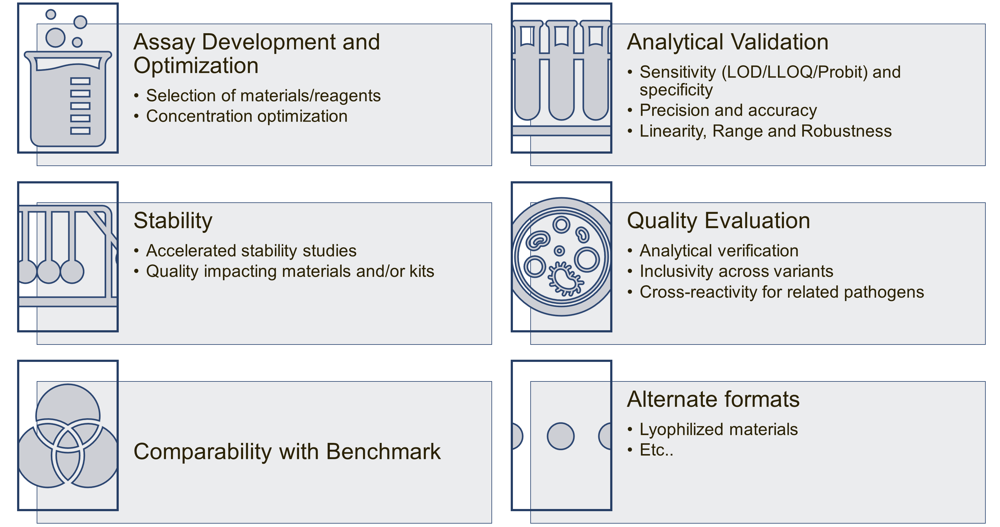
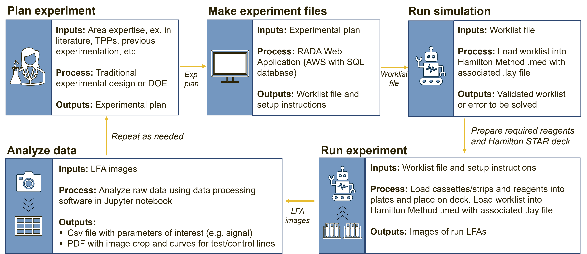

## Overview

The Diagnostic Robotic Optimization Platform (DROP) was developed by GH Labs to support high throughput development of diagnostic chemistries, with an initial focus on Lateral Flow Assays (LFAs) and Nucleic Acid Amplification Tests (NAATs). The scope of this work includes: 

* Development and validation of robotic platforms for the optimization of lateral flow assay and nucleic acid amplification chemistries. 
* Application of the high-throughput screening platform to identify best performing antibodies for LFAs in multiple disease areas. 
* Demonstration of utility of Design of Experiments for NAAT development. 
* Technology transfer to partners in India and the UK. 

## The Why
Assay development can be a largely manual process that requires a large amount of hands-on time from highly trained laboratory personnel. The DROP system uses an automated liquid handling robot to support assay development efforts. The benefits of such a system include: 

* **Time** - potential to decrease both total development time and total hands-on time required
* **Maximizes experiment size** - no longer limited by how many strips or plates on person can run at a time
* **Reproducibility** - ensuing greater accuracy and consistency

Applications of this system can include, but are not limited to: 

<small>Figure 1. Potential application areas for the DROP system. All of these categories can apply to both NAAT and LFA technologies. </small>

## The How

Included on this site is everything required to implement the DROP system for both the roboNAAT and roboLFA modules.This includes (1) custom hardware, (2) custom software for experimental design and data analysis, and (3) protocols. Additional support in the form of a troubleshooting guide and glossary can be found under the Project Overview tab. 

Running an experiment using the DROP system requires the use of a number of tools specifically designed for this purpose. For both LFA and NAAT, the workflow is similar, and includes:

+ Planning the experiment 
+ Making the experiment files
+ Running the experiment files in simulation
+ Running the experiment (for real this time)
+ Getting and analyzing the data
+ Repeating as needed

RoboLFA is the DROP module that was designed to run LFA chemistries on the Hamilton STAR. This system has been used primarily for the selection and optimization of antibody pairs for a traditional LFA antibody stack. Additional applicaitons include optimization of membrane materials, blocking and running buffers, drying and spraying conditions, and conjugate chemistry optimization. More about this module can be found in the RoboLFA tab above. 

<small>Figure 4. Flow chart describing use of DROP system for LFA applications. </small>

RoboNAAT is the DROP module that was designed to run NAAT chemistries on the Hamilton STAR. This module has been used for the optimization and characterization of a range of nucleic acid amplification chemistries, including polymerase chain reaction (PCR), loop-mediated isothermal amplification (LAMP) and recombinase polymerase amplification (RPA). 

<small>Figure 3. Flow chart describing use of DROP system for NAAT applications. </small>

## Ongoing work/next steps

+ RoboNAAT and RoboLFA designs locked and available to be shared 
+ RADA web application for simplified use of Hamilton STAR completed and available for additional deployments
+ This technology has been transferred to partners in India (C-CAMP/InDx and MolBio/Bigtec EDGE 2.0) and the UK (GADx) 
+ Continued development is needed in the following areas:
    + Application of DROP to accelerate bringing diagnostic products to market
    + Experimental design for NAAT experiments – finding optimal DOE for different amplification chemistries 
    + Integration with fluorescence readout to enable non-colorimetric readout for protein or nucleic acid-based assays 
